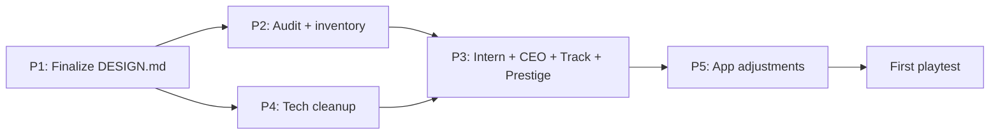

# MVP Plan — Roadmap to the first playtest

Goal: an internally consistent rule set + minimum card content allowing a
**2-3 player, ~60 minute test game** (with hand-cut / handwritten cards,
no print-ready layout).

Source of actual design decisions: [`../design/DESIGN.md`](../design/DESIGN.md).
Rationale for infrastructure and workflow: [`SETUP_PLAN.md`](SETUP_PLAN.md).
Current state: [`progress.md`](progress.md).

---

## Phases

### Phase 1 — Finalize DESIGN.md (blocking)

The first version of DESIGN.md is created during setup, but reaching
playtest-ready needs polish:

- Every section cross-checked with the referenced DDRs.
- Every "placeholder" value (project track scale, thresholds, slot counts)
  explicitly flagged and moved into
  [`open-questions.md`](../design/open-questions.md).
- Setup section is actually usable at the table (not an abstract
  description).

### Phase 2 — Card content audit + inventory

Working tool: [`inventory.md`](inventory.md).

- **Production employees** (`src/data/employees.tsx` `employees`):
  reclassify every card to `JUNIOR | SENIOR` (the `MEDIOR` tier is gone).
  Target: ~6-8 unique Juniors + ~6-8 unique Seniors.
- **Admin employees** (`src/data/employees.tsx` `backoffice`): every card
  gets a `level` field. Tina/Alice/Ahmed → Junior; Charles/Eve/Donna/
  Francis/Grace/Haruto → Senior (initial proposal, tunable).
- **Items** (`src/data/items.tsx`): canonize text, fix typos
  ("Energy drinnk" → "Energy drink", etc.).
- **Features** (`src/data/functional_contracts.tsx`): keep ~20-25. The
  `sector` field stays in the data (and stays **optional** on the
  `Contract` model) — it is inactive for MVP (DDR-0006), but kept around
  so the mechanic can be revisited post-MVP without re-tagging cards. Fix
  typos.
- **Technologies** (`src/data/tecnical_contracts.tsx`): cleanup under the
  new open-source mechanic — every card's top half must be a standalone,
  self-consistent ongoing effect (empty / "do-nothing" top is also
  allowed; see DDR-0010 clarification); the bottom half is active only
  privately or as the most recent open-source. Fix the duplicate `T-017`
  cardNumber. Target: **20-24 unique techs**, 1 copy each (variety over
  duplication for the playtest). Cuts done in Phase 4 are commented out
  in place rather than renumbered — final resequencing happens close to
  release.
- **Prestige Employee**: 1 unique card (cost X, +Y prestige end-of-game),
  ~10 copies. A single market slot.

The inventory matrix records: card × status × copy count × notes.

### Phase 3 — Create new content

- **Intern cards** in `src/data/starter_employees.tsx`:
  CEO + 9 interns (Dev / HR ratio: tunable, initial proposal 5/4).
- **CEO card** ability finalized (the current "top 3 contracts, purge 1"
  text either brought to a concrete end-state or dropped for MVP).
- **Project Track** placeholder scale laid out as a reference card
  (values: `open-questions.md`).
- **Prestige Employee** card concretized.
- **New Technology cards**: design and add ~5-10 new techs in
  `src/data/tecnical_contracts.tsx` to bring the total from ~15 active
  uniques (Phase 4 result) up to the 20-24 target band. Each new card
  must satisfy DDR-0010 (top half persistent or intentionally empty;
  bottom half optional). Use new `T-NNN` numbers above the highest
  existing one — do not reuse commented-out slots.

### Phase 4 — Clean up Technology cards for the new open-source mechanic

- Field names on the `Technology` model (`topEffects/topDescription`,
  `bottomEffects/bottomDescription`) **stay**. Only the semantics is
  pinned: top = always active, bottom = only private or most-recent
  open-source.
- Every tech card cross-checked: top half must be standalone and
  self-consistent. **Empty top half is allowed** (see DDR-0010
  clarification): such cards trade higher bottom power for zero
  contribution once covered.
- Duplicate `T-017` cardNumber fixed.
- Cards that don't meet the bar are **commented out in place** (never
  deleted, never renumbered) so the gap and the rationale stay visible
  in the source.
- Output of Phase 4: **15 active unique tech cards**. The remaining
  5-9 needed to hit the 20-24 target are produced in Phase 3 (see new
  content step there).

### Phase 5 — Minimal app-level adjustments

- `src/App.tsx`: render the `starter` section; Junior/Senior split if
  useful.
- `src/components/TechnologyCard/TechnologyCard.tsx`: visually emphasized
  divider line (must be unambiguous on print where to cover).
- Empty `photoSrc` fields and duplicate `cardNumber` lints fixed.
- Any type errors after the above changes fixed.

---

## Phase dependencies

---

## Definition of Done for MVP

1. `DESIGN.md` standalone is enough that an unfamiliar player can set up
   and play a game (with the placeholder values).
2. The `inventory.md` table tells you exactly which cards to print and how
   many copies — and they all exist in `src/data/`.
3. The React app loads and shows every MVP card with readable text
   (visual quality not required).
4. The `## [Unreleased]` section of `CHANGELOG.md` reflects every
   substantive change made on the way to MVP.

---

## Out of scope for MVP

- Print layout, cut marks, asset replacement.
- Tabletop Simulator mod.
- Effect enum / TriggeredAbility model full refactor.
- Industry / Sector, Hobby, Government Project, 50-budget instawin (see
  the relevant DDRs).
- Multiple Prestige Employee variants.
- Balance tuning (that's the playtest's job).
