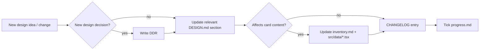

# Setup Plan — Workflow & Documentation Infrastructure

This file records the meta-level decision to build a stable documentation
and workflow infrastructure **before** the actual design and content work
that leads to the first playtest. The file itself is part of that
infrastructure, and is also a historical record of **why** the `docs/` and
`.cursor/` layout looks the way it does.

Status: **living**. Update when there is a structural change to the
infrastructure (new folder, new convention, removed rule).

---

## Why infrastructure first, content second

The project is an early-prototype board game where:

- The rulebook and the card content **change in parallel**, and the two
  drift apart easily (see: current `BASE_RULES.txt` vs. `src/data/*.tsx`
  inconsistencies).
- Design decisions happen in conversations; if they are not explicitly
  recorded, the **why** becomes hard to reconstruct later.
- The React app is only a visualization tool, but anyone (human or agent)
  who touches it has to maintain consistency between the rulebook and the
  card content.
- For an iterative AI-assisted workflow, **writing conventions down
  explicitly** dramatically reduces drift and regression.

The chosen solution: a canonical design document + Design Decision Records
+ an explicit execution plan + Cursor rules that steer agents toward the
right working method.

---

## What we create

```
/AGENTS.md                          # entry point for AI agents
/CHANGELOG.md                       # game design + content change log
/docs/
  design/
    DESIGN.md                       # CANONICAL core mechanic doc
    open-questions.md               # playtest-pending open questions
    decisions/                      # Design Decision Records
      TEMPLATE.md
      0001-…md, 0002-…md, …
  plan/
    SETUP_PLAN.md                   # THIS FILE
    MVP_PLAN.md                     # roadmap to the first playtest
    inventory.md                    # card inventory matrix
    progress.md                     # state checklist
/.cursor/
  rules/
    design-source-of-truth.mdc
    card-data-conventions.mdc
    decision-recording.mdc
    changelog-discipline.mdc
    plan-execution.mdc
```

The existing `BASE_RULES.txt` and `formatted_rules.html` **stay in place**,
but a deprecation banner is added at the top of each, pointing to
`docs/design/DESIGN.md` as the canonical source. (They have historical /
archaeological value for understanding the design evolution.)

---

## Decided principles

1. **Single canonical rule source**: `docs/design/DESIGN.md`. If anything
   contradicts it, DESIGN.md wins.
2. **Every substantive design decision becomes a DDR** in
   `docs/design/decisions/`. New DDRs get new sequence numbers; existing
   DDRs aren't rewritten — they get deprecated with `Superseded by`.
3. **Every rule / content change gets a CHANGELOG entry** in the
   `## [Unreleased]` section (Keep a Changelog style).
4. **Card text is the canonical rule**: in the `src/data/*.tsx` files the
   `text` field is what the player reads on the card. The `Effect` enum is
   **not extended** with new types during the MVP phase.
5. **Plan-driven execution**: before any substantive work, `progress.md`
   reflects the current state; the agent (and developer) picks up the next
   task from there.
6. **Backfill**: design decisions made in past conversations are
   retroactively captured as DDRs, so the full story can be read in one
   place.

---

## Workflow that emerges from this



---

## Build order

1. Folder structure (done).
2. `SETUP_PLAN.md` (this file).
3. `MVP_PLAN.md` + `inventory.md` skeleton + `progress.md` skeleton.
4. DDR `TEMPLATE.md` + backfill DDRs (asking back where the legacy intent
   isn't clear).
5. `open-questions.md`.
6. `DESIGN.md` first version — synthesis of DDRs and clarifications.
7. `AGENTS.md` + `CHANGELOG.md`.
8. `.cursor/rules/*.mdc`.
9. Deprecation banners on legacy files.
10. Self-check: every link works, every referenced file exists.

The actual design work and content audit only starts after this — see
[`MVP_PLAN.md`](MVP_PLAN.md).

---

## Out of scope

- Print-ready layout, print workflow, asset replacement.
- Tabletop Simulator mod, automated packaging.
- The React app as a software project (lint, test, CI). It's only a
  visualization tool; if it runs and shows the cards, that's enough.
- Full TypeScript model refactor. The model only changes if rendering or
  a concrete MVP need requires it.
